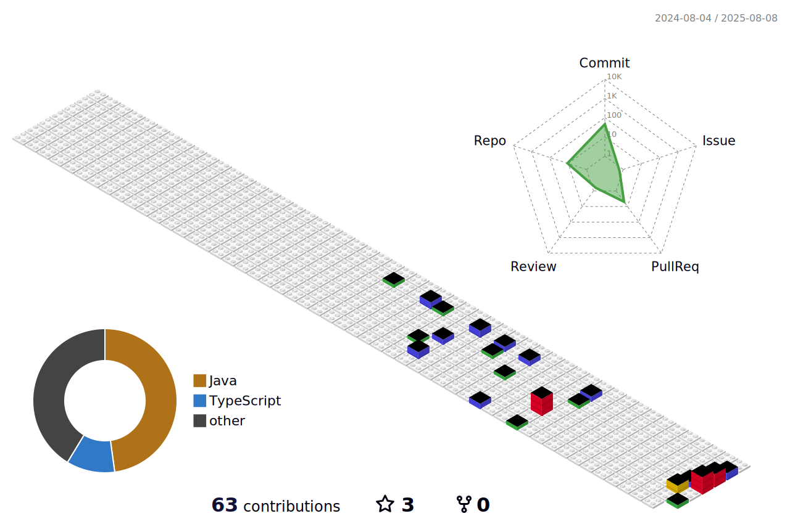

<h1 align="center">Victor Hugo</h1>

  Desenvolvedor Back-End

---

Me chamo Victor Hugo Araujo, tenho 17 anos e sou natural de São Paulo. Atualmente, estou cursando o 3° ano do Ensino Médio e também o curso técnico em Desenvolvimento de Sistemas Full Stack no SENAI Suiço-Brasileiro. Sou apaixonado por tecnologia e compartilho meu conhecimento através do meu GitHub onde mostro tudo que estou aprendendo no dia a dia.

---

### 

  
  
  
  
  
  
  
  
  
  
  
  
  
  
  
  
  
  
  
  
  
  

###

---

  

